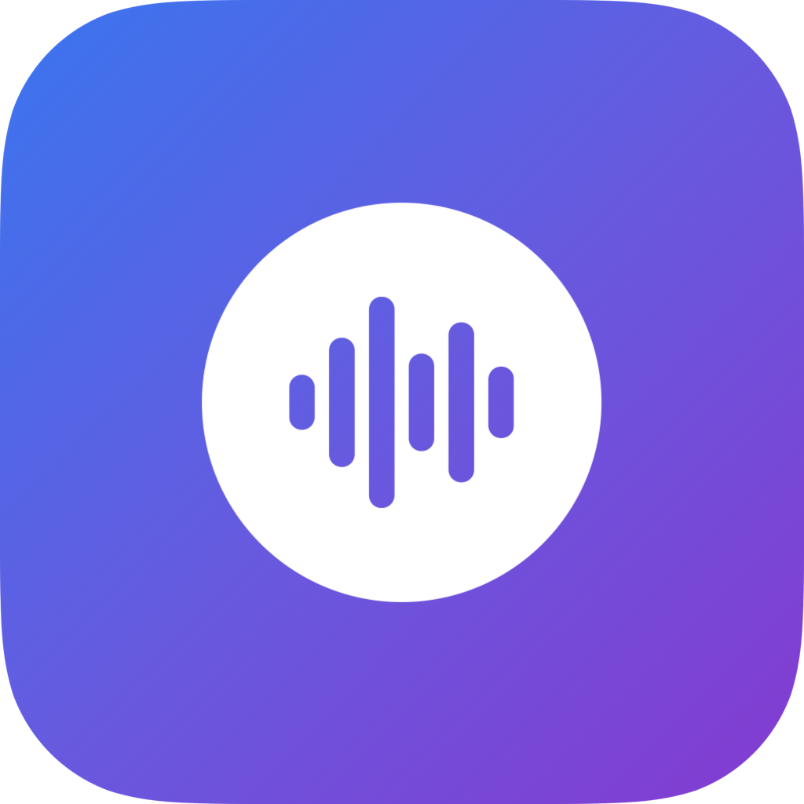

<p align="center">
  
</p>

<h1 align="center">OpenFlow</h1>

<p align="center">
  A fast, private dictation app for macOS — powered by whisper.cpp
</p>

<p align="center">
  
  
  
</p>

---

## What is OpenFlow?

OpenFlow is a lightweight macOS menu bar app that turns speech into text — entirely on your device. Press a global shortcut, speak naturally, and have your words inserted into whatever app you're using.

No cloud. No API keys. No subscriptions. Just fast, private dictation.

### Key Features

- **100% Local** — All transcription runs on-device using [whisper.cpp](https://github.com/ggerganov/whisper.cpp). Your audio never leaves your Mac.
- **Global Shortcut** — Hold `⌃⌥Space` anywhere to record, release to transcribe and insert text.
- **Apple Silicon Optimized** — Takes advantage of the Neural Engine and GPU acceleration on M-series chips.
- **Multiple Models** — Choose from Tiny, Base, or Small models depending on your speed vs. accuracy preference.
- **Smart Insertion** — Text is inserted via clipboard paste (fast) or simulated typing (clipboard-safe).
- **Text Replacements** — Define custom substitution rules that run automatically after transcription.
- **Multi-language** — Supports English, Spanish, French, German, Italian, Portuguese, Japanese, Korean, Chinese, and auto-detection.
- **Minimal UI** — Lives in the menu bar with a floating HUD overlay while recording. Stays out of your way.

---

## Getting Started

### Requirements

- macOS 14.0 (Sonoma) or later
- Apple Silicon (M1/M2/M3/M4) or Intel Mac

### Build & Run

```bash
# Clone the repository
git clone https://github.com/your-username/openflow.git
cd openflow

# Build and run
make run
```

This will compile the app, create an `.app` bundle, and launch it.

### Other Commands

| Command | Description |
|---------|-------------|
| `make build` | Build release binary |
| `make dev` | Build and run in debug mode |
| `make bundle` | Create the `.app` bundle |
| `make dmg` | Create a DMG installer |
| `make install` | Install to `/Applications` |
| `make clean` | Clean build artifacts |
| `make reset` | Reset all app data for a fresh start |

---

## Setup

On first launch, OpenFlow will guide you through onboarding:

1. **Microphone Access** — Required to capture your voice. Audio is processed locally.
2. **Accessibility Access** — Required to insert transcribed text into other apps.
3. **Download a Model** — Choose a Whisper model in Settings → Dictation.

| Model | Size | Speed | Accuracy |
|-------|------|-------|----------|
| Tiny | ~75 MB | Fastest | Good for quick notes |
| Base | ~142 MB | Fast | Better accuracy |
| Small | ~466 MB | Moderate | Best accuracy |

---

## Usage

1. **Press and hold** `⌃⌥Space` (Control + Option + Space)
2. **Speak** — a floating HUD appears showing recording status
3. **Release** — text is transcribed and inserted at your cursor

The menu bar icon provides quick access to settings, last transcript, and history.

---

## Architecture

```
OpenFlow/
├── App/              # App entry point, coordinator
├── Audio/            # Audio capture service
├── Data/             # Database, repositories
├── Processing/       # Text formatting, replacements
├── Resources/        # Info.plist, entitlements, icons
├── Shared/           # Logging, extensions, constants
├── System/           # Permissions, hotkey management
├── Transcription/    # Whisper model manager, transcription
└── UI/
    ├── HUD/          # Floating recording indicator
    ├── MenuBar/      # Menu bar popover
    ├── Onboarding/   # First-launch setup flow
    └── Settings/     # Preferences (General, Dictation, etc.)
```

### Dependencies

| Package | Purpose |
|---------|---------|
| [SwiftWhisper](https://github.com/exPHAT/SwiftWhisper) | Swift bindings for whisper.cpp |
| [HotKey](https://github.com/soffes/HotKey) | Global keyboard shortcut handling |
| [GRDB](https://github.com/groue/GRDB.swift) | SQLite database for transcripts & replacements |

---

## Settings

Access settings from the menu bar icon → **Settings**, or use `⌘,`.

- **General** — Recording mode, HUD visibility, shortcut display
- **Dictation** — Model selection, downloads, language
- **Insertion** — Clipboard paste vs. simulated typing, formatting profiles
- **Replacements** — Custom text substitution rules
- **Permissions** — Microphone and accessibility status

---

## Privacy

OpenFlow is designed with privacy as a core principle:

- **No network requests** for transcription — everything runs locally
- **No telemetry** or analytics
- **No accounts** or sign-ups required
- Audio is processed in memory and never saved to disk
- Models are downloaded once from HuggingFace and stored locally

---

## License

MIT License. See [LICENSE](LICENSE) for details.
